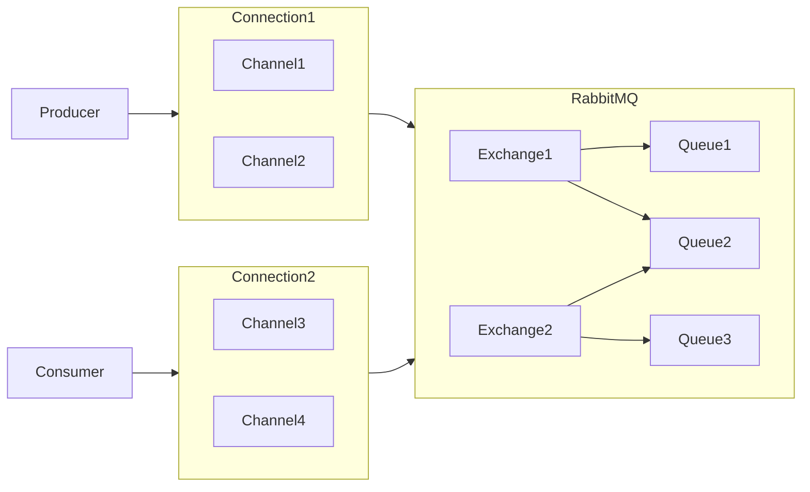
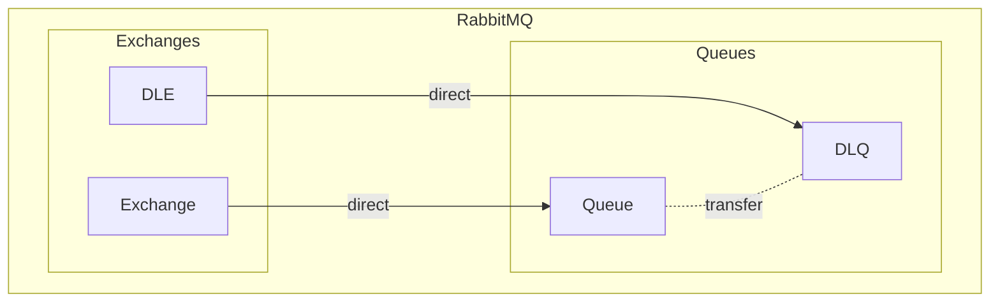

> [!tip]
> 鉴于 AMPQ 实现的多样性，笔记会偏向于描述概念与原理，功能的实现可以参考官方文档或者项目代码。

RabbitMQ 是用于程序之间传递消息的一种软件（专业点来说就是一种中间件）。

工作原理：



## 安装与部署

- ubuntu 环境下使用 apt-get 命令安装 erlang 和 rabbitmq-server
- 程序的运行依赖 Erlang，所以需要同时安装 Erlang
- rabbitmq-server 是服务
- 开启 rabbitmq_management 插件启用 web 管理页面
    - 默认只有一个 guest 用户，且只能本地登陆
- rabbitmqctl 可以进行访问管理

## 基本概念

- Producer：生产消息
- Consumer：消费消息
- [[#交换机 |Exchange]]：分发消息
- Queue：存放消息

## 工作队列

工作队列指一个 Queue 的所有消费者组成的队列，消费者们会竞争 Queue 中的消息。

## 消息应答

消费者通知生产者他收到了消息，生产者以此决定是否发送新消息，这就是消息应答。如果消费者在消息的 TTL 内没有应答，消息会 requeue（重新入队）。除了应答外消费者也可以拒绝消息。

## 持久化

RabbitMQ 重启后，队列和消息都会消失不见，除了持久化的。

- 队列持久化：队列只在创建时允许设置持久化
- 消息持久化：发布消息时设置持久化

## 不公平分发

一个工作队列中消费者轮流消费消息是公平分发，按能力消费是不公平分发。

那么如何开启不公平分发呢？设置消费者的处理能力就好了，因为消费者与 Channel 对应，所以这个设置在 Channel 中，也就是 `Channel.basicQos` 的 prefetch 参数。prefetch 是整数值，单位是消息的条数，表示 Channel 最大能够容纳的待应答的消息的数量。

## 发布确认

生产者确认消费者已经收到了消息，该功能需要手动开启。该功能开启后，生产者在收到消费者的应答后才会发送下一条消息。关于这一点，你需要知道：

- 生产者调用 `Channel.confirmSelect()` 开启 Channel 的发布确认
- 生产者调用 `Channel.waitForConfirms()` 等待回应

发布确认的实现可以分为：

- 单个确认消息：发送一条消息确认一次，速度最慢🐢
- 批量确认消息：发送多条消息后批量确认一次，速度中等，但是出错时无法定位消息
- 异步确认消息：开启多线程进行确认，使用 `Channel.addConfirmListener` 增加一个监听器即可，速度嘎嘎快⚡

## 交换机

交换机负责收取生产者发布的消息，然后分发给交换机绑定的队列。交换机的类型有多种，每种类型有各自的分发规则。

交换机的类型：

- Direct：消息只分发给单个队列
- Topic：消息分发给与匹配的队列
- Fanout🔊：消息分发给所有队列

> [!tip] 关于 Topic 的更多说明
>  交换机中 queue 的 routing key 可以看作一种 pattern，Producer 指定的 routing key 会与交换机中的 routing key 进行匹配，所有匹配的 queue 都能收到消息。

## 备份交换机

可以为交换机配置备份交换机，当交换机中的队列无法接收消息时，由备份交换机代代为接收并进行广播，注意备份交换机的类型需要是 Fanout。

## 死信队列

Dead Letter 是因为 TTL 过期、消息被拒收、队列已满而产生的消息。

这些消息会转发的队列指定的交换机中的 dead letter routing key 中等待下一步处理。这种交换机称为 dead letter exchange。



> [!warning]
>The type of Dead Letter Exchange and the exchange from which dead letters come must be direct.

Dead letter exchange 与 dead letter routing key 在声明队列时作为额外参数配置：

```java
HashMap<String, Object> arguments = new HashMap<>();  
arguments.put("x-dead-letter-exchange", "dead_letter_exchange");  
arguments.put("x-dead-letter-routing-key", "dead_letter_routing_key");  
channel.queueDeclare(QUEUE_NAME, false, false, false, arguments);
```

## 延迟队列

- 延迟队列的两种实现方式——插件与死信队列的与别在于，前者是异步的，而后者是同步的
- 插件是指 [rabbitmq-delayed-message-exchange](https://github.com/rabbitmq/rabbitmq-delayed-message-exchange) 
- 关于如何安装插件可以阅读 [Installing Additional Plugins — RabbitMQ](https://www.rabbitmq.com/installing-plugins.html)
- 该插件提供了一种新的交换机类型： x-delayed-message，进入这种交换机的消息会暂时停留在交换机中，直到预设的 delayed time 过期，再分发给队列
- x-delayed-message 顶多能算一种标签，他还是需要通过可选参数设置交换机类型

```java
@Bean(DELAYED_EXCHANGE)  
public CustomExchange delayedExchange() {  
	Map<String, Object> arguments = new HashMap<>();  
	arguments.put("x-delayed-type", "direct");  
	return new CustomExchange("delayed_exchange", "x-delayed-message", false, false, arguments);  
}
```

## 惰性队列

惰性队列的消息保存在硬盘中，消费时再取出。这样能够显著降低内存空间的占用，同时也会降低消费速度。

实现它只需要将队列的 `x-queue-mode` 配置为 `lazy`。

## 优先级队列

优先级队列中的消息可以配置优先级，然后按优先级消费，高优先级的消息先被消费。

关于实现方面你需要注意以下几点：

- 通过配置 `x-max-priority` 使队列称为优先级队列
- x-max-priority 的数据类型是 unsigned byte，推荐取值范围 1-5
- 消息的优先级作为 other properties 配置，0 为默认值，最大值不会超过 x-max-priority

更多信息参考：[Priority Queue Support — RabbitMQ](https://rabbitmq.com/priority.html)

## 整合 Spring Boot🍃

- spring-boot-starter-amqp
- 使用配置类配置交换机与队列
- [Publisher Confirms and Returns](https://docs.spring.io/spring-amqp/docs/current/reference/html/#cf-pub-conf-ret)

## 搭建集群

这里没有做过多的研究，直接附上课程中的操作过程：

```shell
1.修改 3 台机器的主机名称

vim /etc/hostname

2.配置各个节点的 hosts 文件，让各个节点都能互相识别对方

vim /etc/hosts
10.211.55.74 node1
10.211.55.75 node2
10.211.55.76 node3
 
3.以确保各个节点的 cookie 文件使用的是同一个值在 node1 上执行远程操作命令

scp /var/lib/rabbitmq/.erlang.cookie root@node2:/var/lib/rabbitmq/.erlang.cookie
scp /var/lib/rabbitmq/.erlang.cookie root@node3:/var/lib/rabbitmq/.erlang.cookie

4.启动 RabbitMQ 服务,顺带启动 Erlang 虚拟机和 RbbitMQ 应用服务(在三台节点上分别执行以
下命令)

rabbitmq-server -detached

5.在节点 2 执行

rabbitmqctl stop_app
(rabbitmqctl stop 会将 Erlang 虚拟机关闭，rabbitmqctl stop_app 只关闭 RabbitMQ 服务)
rabbitmqctl reset
rabbitmqctl join_cluster rabbit@node1
rabbitmqctl start_app(只启动应用服务)

6.在节点 3 执行

rabbitmqctl stop_app
rabbitmqctl reset
rabbitmqctl join_cluster rabbit@node2
rabbitmqctl start_app

7.集群状态

rabbitmqctl cluster_status

8.需要重新设置用户

创建账号
rabbitmqctl add_user admin 123
设置用户角色
rabbitmqctl set_user_tags admin administrator
设置用户权限
rabbitmqctl set_permissions -p "/" admin ".*" ".*" ".*"

9.解除集群节点(node2 和 node3 机器分别执行)

rabbitmqctl stop_app
rabbitmqctl reset
rabbitmqctl start_app
rabbitmqctl cluster_status
rabbitmqctl forget_cluster_node rabbit@node2(node1 机器上执行)
```

## 队列镜像

这个功能已经在最新版本中移除，并被 [Quorum Queues — RabbitMQ](https://www.rabbitmq.com/quorum-queues.html) 取代。
